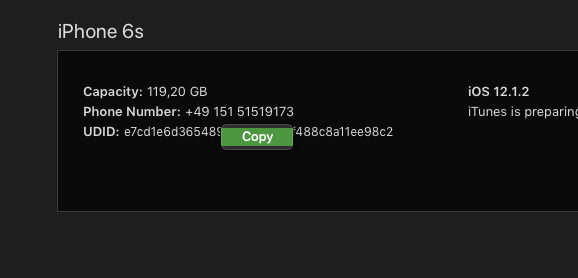

# chowchow

Mediapeers React native app

### Mediapeers Video Framework

For info regarding the [MediaPeers framework](./MEDIAPEERS.md)

## Installation

Install local dependencies

```shell
cd chowchow
yarn
```

Install global dependencies

```shell
npm install react-native-cli -g
```

### iOS

iOS uses CocoaPods to install dependencies

Run the following command or chose one of the options from https://cocoapods.org/ to install CocoaPods

```shell
sudo gem install cocoapods
```

Then to install the dependencies.

```shell
npm run pod:install
```

### Android

Make sure to export the `ANDROID_HOME` path in you .zshrc or .bashrc if you wish to run builds from the command line

```shell
# Android
export ANDROID_HOME=$HOME/Library/Android/sdk
export PATH=$PATH:$ANDROID_HOME/tools
export PATH=$PATH:$ANDROID_HOME/tools/bin
export PATH=$PATH:$ANDROID_HOME/platform-tools
```

Android uses Gradle to manage dependencies. Simply open Android Studio to "Sync" your project. This will install the dependencies. Alternatively you can run the following command.

```shell
npm run build:android
```

A temporary hack is needed to fix "androidx" support until React Native supports it. Run the following to update the android dependencies after syncing.

```shell
npm run androidx_rewrites
```

### Deployment Dependencies

We are using [Fastlane](https://docs.fastlane.tools/) to manage releases, provisioning profiles, certificates, etc

> fastlane is the easiest way to automate beta deployments and releases for your iOS and Android apps. 🚀 It handles all tedious tasks, like generating screenshots, dealing with code signing, and releasing your application.

Install Fastlane using

*Using RubyGems*

```shell
sudo gem install fastlane -NV
```

*Alternatively using Homebrew*

```shell
brew cask install fastlane
```

Make sure your fastlane path has been exported in your `.zschrc` or `.bashrc`

```shell
# Fastlane
export PATH="$HOME/.fastlane/bin:$PATH"

export NODE_BINARY=$(which node)
```

Install [Bundle](https://bundler.io/)

```shell
gem install bundler
```

Install Packages

```shell
bundle install
```

### Deployment Credentials

In order to submit builds you need to permission. Obviously.

#### iOS

The AppStore requires apps to be signed. The iOS certificates are in encrypted and stored at https://github.com/mediafellows/chowchow-certs. You need these along with the decryption passphrase, and the credentials for your Apple Developer Account. Make sure you export an email address that has priviledges to CRUD certificates and upload builds from your `.zshrc` or `.bashrc`.

```shell
# Fastlane Match
export MEDIAPEERS_APPLE_ID="my-apple-email@address.com"
```

#### Android

Android uses a *Java Keystore* `.jks` or `.keystore` to sign builds. You will need the store file and its password to decrypt it. Then you will need the `alias` (the key name e.g. 'MediaPeers-Staging-Upload') and its password to successfully sign a build. The keystore holds the keys for all build types.


Expand on the keychain stuff !!!!!!!!

## Build for Development

Run the following command in a terminal window and to start the metro bundler.

**Leave it running**

```shell
npm start
```

> NOTE: See Android > On Device below and set the Device Id before running npm start

### iOS

Either via Xcode by opening `/ios/chowchow.xcworkspace` **NOT** `.xcode.proj`. Tip: `npm run launch:xcode`

or via

```shell
npm run ios
```

### Android

Either via Android Studio by opening the `/android` directory from the launch dialog by clicking 'Open an existing Android Studio project'. Tip: `npm run launch:studio`

or via

```shell
npm run android
```

#### On device

To run on device you should set the `ANDROID_DEVICE` in your `.taskrc` see below.
To find your android device ID, connect your device and run:

```shell
npm run get_android_devices
```
And grab the corresponding ID

## Build for Staging & Production

Make sure you have the dependencies for deployment

### iOS

Build and upload a staging build

```
npm run staging:ios
```

#### Adding test devices

You need all the dependencies mentioned above to make builds for the AppStore. For both Staging and Production builds, that you wish to share via Apple's Testflight, must be signed with the device's UDIDs it will be tested on. In `/fastlane/devices.txt` you will find the list of current devices. After modifying this file run the following command to update the devices in the AppStore and generate the new certificates.

```
npm run ios:certificates
```

**Whats's my UDID?** Good question either, plugin your iOS device and run:

```
npm run get_ios_device
```

or plugin your device and open iTunes. Click on the "device icon".


Click on "Serial Number", this will toggle through all the the different identifiers. Right click on the UDID and click "copy"



```
npm run staging:ios
```

**IMPORTANT: You must have a tab NOT spaces between the Device ID and the Device Name**
Or else it will no parse on Apple's end

### Android

... more info to come

```
npm run staging:android
```

Testers need to visit https://play.google.com/apps/testing/com.mediapeers.mediastore.staging


```
npm run release:android
```

Testers need to visit https://play.google.com/apps/testing/com.mediapeers.mediastore

#### Adding test devices

Testers need to provide google email addresses. These addresses need to me added in the PlayStore > App Releases > Alpha > Manage Release > Edit (Mediapeers testers)


## Taskfile

A super simple shell task runner

https://medium.com/@adrian_cooney/introducing-the-taskfile-5ddfe7ed83bd

All the tasks for the app can be found in the `/taskfile`. All public tasks are mapped to `npm scripts` in the `package.json` and can be run either via `./taskfile {command}` or `npm run {command}`

### commands

To list all the public tasks run

```shell
npm run help
```

Example output

```shell
Tasks:
     1	androidx_rewrites
     2	appicon
     3	build:android
     4	bundle:android
     5	bundle:ios
     6	clean
     7	fastlane:certificates
     8	fun
     9	get_android_device
    10	get_android_devices
    11	get_ios_device
    12	get_ios_devices
    13	help
    14	launch:studio
    15	launch:xcode
    16	link
    17	lint
    18	pod:install
    19	pod:reinstall
    20	postinstall
    21	release:android
    22	run:android
    23	run:ios
    24	staging:android
    25	staging:ios
    26	start
    27	test
    28	test:android
    29	test:ios
    30	tsc
```

### .taskrc

A simple bash file which holds personal settings for Taskfile. It should not be commited to GIT. Example:

```shell
#!/bin/bash
ANDROID_DEVICE=YOUR_CONNECTED_DEVICE_ID
LAUNCH_DEBUGGER=true
```

## Adding Targets / Buildtypes

#### iOS

I can't really explain this better than this blog has

https://medium.com/@tgpski/running-ios-builds-part-3-react-native-devops-guide-4b1fdc40b49

#### Android

I can't really explain this better than this blog has

https://medium.com/@tgpski/running-android-builds-part-4-react-native-devops-guide-ddc36c12061

## Troubleshooting

#### Android Linking issues

Due to the changes in `MainApplication.java` needed for both the Mediapeers and ReactNativeNavigation libraries, linking can fail when running `npm run link`. You may have to insert the packages manually e.g.

```java
protected List<ReactPackage> getPackages() {
    // Add additional packages you require here
    // No need to add RnnPackage and MainReactPackage
    return Arrays.<ReactPackage>asList(
            new FastImageViewPackage(),
            new VectorIconsPackage(),
            new FingerprintAuthPackage(),
            new KeychainPackage(),
            MediapeersPlayer.Companion.getRnAppPackage()
    );
}
```

### Trouble connecting to debugger

Open a browser tab at http://localhost:8081/debugger-ui/ sometimes the url has been changed to something like http://10.0.2.2:8081/debugger-ui and causes error. So use `localhost`.

Also sometimes you will cross domain issues. Install a CORS plugin for Chrome such as

https://chrome.google.com/webstore/detail/allow-cors-access-control/lhobafahddgcelffkeicbaginigeejlf?hl=en

Just remember to turn it off after developing

#### Fallback

If you have an issue you can't explain, that won't go away try the following command to completely destroy all cache for iOS, Android, and Metro

```shell
npm run clean
```

> then don't forget to reinstall `npm install`

If you are using Android Studio you can try clicking `File` > `Invalidate Caches / Restart...`


## XCode is taking up too much space

You can clear up space by deleting the following files

#### ~/Library/Developer/Xcode/DerivedData/

 The Derived Data folder here contains all of your project’s intermediate build information, index and debug/release built targets. You will generally delete this data when you observe peculiar behaviour like improper indexing or slowness of Xcode. Deleting all folders(Not derived data folder itself) from derived data will just make all your projects to be recreated when you build again; rebuilding will be bit slower.

#### ~/Library/Developer/Xcode/Archives

All your targets are kept in archived form in Archives folder. Before you decide to delete contents of this folder, here is a warning - if you want to be able to debug deployed versions of your App, you shouldn’t delete the archives.

#### ~/Library/Developer/Xcode/iOS DeviceSupport

iOS Device Support folder creates a subfolder with the device version as identifier when you attach the device. Most of the time it’s just old stuff. Keep the latest version and rest of them can be deleted (if you don’t have an app that runs on 5.1.1, there’s no reason to keep the 5.1.1 directory/directories). If you still have a device running a particular version, the directory will be recreated by Xcode when you attach the device. And, no, this has nothing to do with simulator.

#### ~/Library/Developer/CoreSimulator

Core Simulator folder is familiar for many Xcode users. It’s simulator’s territory; thats where it stores app data. It’s obvious that you can toss the older version simulator folder/folders if you no longer support your apps for those versions. And, it’s safer to use ‘Reset content and Settings’ option from menu to delete all of your app data in a Simulator.

> This and more can be found http://ajithrnayak.com/post/95441624221/xcode-users-can-free-up-space-on-your-mac


## Third party

Here you will find a list of all the third party libraries and a little info about them.

### React Native Navigation

React Native Navigation provides native platform navigation on both iOS and Android.

https://wix.github.io/react-native-navigation/

### React Native Fast Image

FastImage is a replacement for React Native's Image Component, that adds alot of caching functionality. FastImage is a wrapper around SDWebImage (iOS) and Glide (Android).

https://github.com/DylanVann/react-native-fast-image

Due to the AndroidX issue I had to follow this step

https://github.com/DylanVann/react-native-fast-image/blob/master/docs/app-glide-module.md

from this issue

https://github.com/DylanVann/react-native-fast-image/issues/370

### React Native Progress

Progress indicators and spinners for React Native using ReactART.

https://github.com/oblador/react-native-progress

### React Native Touch ID

A library for iOS TouchID and FaceID and Android Touch Authentication

https://github.com/naoufal/react-native-touch-id

### React Native Keychain

A library to store user credentials for use with TouchID

https://github.com/oblador/react-native-keychain

### Polyglot

A simple localization library from AirBnB

https://github.com/airbnb/polyglot.js

### React Native Button

A simple ReactNative component for making buttons

https://github.com/ide/react-native-button

### React Native DropDownAlert

A simple alert to notify users about new chat messages, something went wrong or everything is ok.

https://github.com/testshallpass/react-native-dropdownalert


### React Native Orientation

Listens to device orientation changes in react-native and set preferred orientation on screen to screen basis.

https://github.com/yamill/react-native-orientation


### React Native Toolbox

A toolbox to make adding iOS icons easier

https://github.com/bamlab/generator-rn-toolbox

**Installation**

```shell
npm install -g yo generator-rn-toolbox
```

**Usage**

```shell
./taskfile appicon ./my/awesome/icon/1024x1024.png
```
